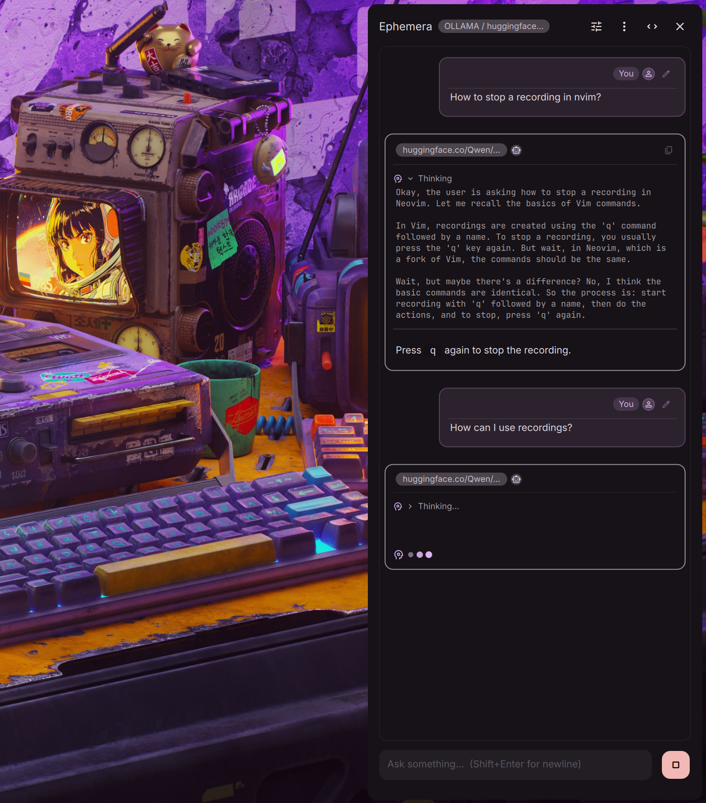

# Ephemera


 <!-- x-release-please-version -->

AI chat for your desktop — ask quick questions, keep nothing (or everything).



Ephemera is a [Quickshell](https://github.com/quickshell-mirror/quickshell) plugin that adds an AI chat slideout panel to your Wayland desktop shell. By default, all conversations live in memory and disappear when you close the panel. Enable **Save Chat History** in settings to persist conversations across sessions.

## Features

- **Multiple providers** — Ollama, OpenAI, Anthropic, Gemini, or any OpenAI-compatible endpoint
- **Streaming responses** — real-time token-by-token output via SSE
- **Thinking/reasoning display** — collapsible thinking section for models that emit `<think>` tags (Qwen3, DeepSeek via Ollama) or explicit `reasoning_content` fields (DeepSeek via OpenAI-compatible providers); thinking and generating phases shown with distinct dot colors
- **Ollama auto-management** — automatically starts `ollama serve` if not running, discovers available models, and re-checks connectivity each time the panel opens
- **Markdown rendering** — assistant responses rendered as rich text with code blocks, tables, lists, and blockquotes (deferred until streaming completes for performance)
- **System prompt presets** — quick-select presets (Concise, Code Expert, Translator, Writing Editor) or write a custom system prompt
- **Regenerate with variant pagination** — retry the last assistant response with a single click; previous responses are preserved and navigable with `< 1/2 >` pagination arrows (ChatGPT-style), even mid-stream; each variant remembers which model generated it, so switching models between regenerations shows the correct model chip per variant
- **Export conversation** — copy the full conversation as markdown to clipboard, or save to a `.md` file in your home directory
- **Optional persistence** — messages are ephemeral by default; enable **Save Chat History** in settings to persist conversations across sessions (API keys are never stored)
- **Security-first** — request bodies sent via stdin (never in `/proc/cmdline`), API keys passed as headers (not URL params), link text and URLs HTML-escaped, link scheme restricted to http/https, custom URLs validated, stdout buffer capped at 5 MB

## Requirements

- [Quickshell](https://github.com/quickshell-mirror/quickshell) with a configuration that provides `qs.Common`, `qs.Widgets`, and `qs.Services` modules
- `curl` (used for API requests)
- `wl-copy` from [wl-clipboard](https://github.com/bugaevc/wl-clipboard) (for the copy button)
- For Ollama: [Ollama](https://ollama.com) installed and at least one model pulled

## Installation

Place or symlink this directory into your Quickshell configuration's plugin path, then reload the shell.

## Configuration

### API Keys

Set the appropriate environment variable before starting Quickshell:

| Provider   | Environment Variable  |
|------------|-----------------------|
| OpenAI     | `OPENAI_API_KEY`      |
| Anthropic  | `ANTHROPIC_API_KEY`   |
| Gemini     | `GEMINI_API_KEY`      |
| Custom     | `EPHEMERA_API_KEY`    |
| Ollama     | *(none required)*     |

### Settings

All settings are configurable from the in-app settings panel (tune icon):

- **Provider** — ollama, openai, anthropic, gemini, or custom
- **Model** — auto-discovered dropdown for Ollama, free-text for others
- **Ollama URL** — defaults to `http://localhost:11434`
- **Custom Base URL** — for OpenAI-compatible endpoints (validated: http/https only, valid hostname, max 2048 chars)
- **Extended Thinking** — toggle for Anthropic provider; enables extended thinking (forces temperature to 1.0, allocates 80% of max tokens as thinking budget)
- **System Prompt** — prepended to every request; quick-select presets available or enter custom text
- **Temperature** — 0.0 (focused) to 2.0 (creative)
- **Max Tokens** — 256 to 16,384
- **Context Turns** — number of recent conversation turns sent to the API (2–100)
- **Request Timeout** — max time for a streaming response (30–600s, default 300s)
- **Ollama Controls** — refresh models button, explicit start/stop button, idle auto-stop timeout (Never, 5, 10, 15, or 30 minutes; only auto-stops Ollama if the plugin started it)
- **Save Chat History** — persist conversations across sessions (off by default)

Settings are persisted via Quickshell's `PluginService`. API keys are never stored.

## Usage

Open the slideout panel via your shell's configured keybind or action. Type a message and press **Enter** to send (Shift+Enter for newline). Press **Escape** to dismiss the panel.

**Keyboard shortcuts:**

| Shortcut | Action |
|---|---|
| Enter | Send message |
| Shift+Enter | Insert newline |
| Escape | Close panel |
| Ctrl+L | Clear chat |
| Ctrl+N | New conversation (clear chat + composer) |
| Ctrl+Shift+S | Toggle settings |
| Up arrow | Recall last sent message (when composer is empty) |

- **Copy** — hover over an assistant message to reveal the copy button (shows a checkmark on success)
- **Regenerate** — hover over the last assistant message to reveal the regenerate button; after regenerating, use the `<` `>` arrows to navigate between response variants; each variant's model chip shows which model generated it
- **Export** — click the copy icon in the header to copy the conversation as markdown, or the save icon to write it to `~/ephemera-chat-<timestamp>.md`
- **Expand** — use the expand button to widen the panel (480px → 960px); model chips in the header and message bubbles expand to show full model names
- **Error hints** — HTTP errors display contextual suggestions (e.g., 401 → check API key, 429 → rate limited)
- **Missing API key banner** — when a required API key is absent, a prominent banner in the chat area shows which environment variable to set

## Known Limitations

- **Multi-screen**: The chat service is shared across all screens. Opening the panel on two monitors shows the same conversation.

## Troubleshooting

### Ollama not detected

Ephemera pings `http://localhost:11434/api/tags` on startup. If Ollama isn't found:

1. Verify Ollama is installed: `ollama --version`
2. Pull at least one model: `ollama pull llama3.2`
3. Ephemera will auto-start `ollama serve` if it isn't running — check that the Ollama binary is in your `$PATH` when Quickshell starts
4. If using a custom URL, verify it in Settings → Provider → Ollama URL
5. Use the **Connect to Ollama** button in Settings to retry

### API key not detected

API keys are read from environment variables. They must be set **before** Quickshell starts.

```bash
# In your shell profile (~/.bashrc, ~/.zshrc, etc.):
export OPENAI_API_KEY="sk-..."
export ANTHROPIC_API_KEY="sk-ant-..."
export GEMINI_API_KEY="AI..."
export EPHEMERA_API_KEY="..."   # for custom providers
```

Check that the variable is set: `echo $OPENAI_API_KEY`

If it's set but Ephemera still shows "API key not found", Quickshell may not be inheriting your shell environment. Try launching Quickshell from a terminal where the variable is set.

### Empty responses

- Verify the model name is correct for your provider
- Check that streaming is supported by your endpoint
- Increase the **Request Timeout** slider in Settings (default 300s)
- For Ollama, ensure the model is fully downloaded: `ollama list`

### Timeout errors

The default timeout is 300 seconds. For large models or slow hardware, increase it in Settings → Model Parameters → Request Timeout (max 600s).

## Custom Provider

The "custom" provider works with any OpenAI-compatible API (LocalAI, vLLM, LM Studio, OpenRouter, Groq, etc.). Set the base URL in Settings and export `EPHEMERA_API_KEY`. Ephemera appends `/v1/chat/completions` automatically unless the URL already ends with a versioned path.

## License

MIT
